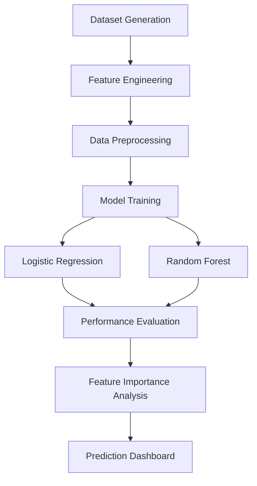

# 🎓 Student Performance Predictor

### Machine Learning Based Academic Performance Analysis System

> Student Performance Predictor is a research-oriented machine learning platform designed to analyze and predict academic success using statistical modeling and ensemble learning techniques. The system evaluates critical determinants such as attendance, study patterns, socio-economic factors, and parental education to support early educational intervention.

---

# 🌐 Live Demo

## 🔗 Website
https://studentperfoma.netlify.app/

---

# 📌 Project Overview

This project presents a comparative machine learning framework for predicting student academic outcomes using:

- 📊 Logistic Regression
- 🌲 Random Forest Classifier
- 📈 Feature Importance Analysis
- 📉 Performance Evaluation Metrics
- 🧠 Predictive Academic Analytics

The platform combines machine learning engineering, statistical analysis, and modern web technologies to create an interpretable educational intelligence dashboard.

---

# 🚀 Features

## 🎯 Predictive Analytics
- Student performance prediction
- Early academic risk identification
- Attendance impact analysis
- Socio-economic factor evaluation
- Feature importance visualization

---

## 🤖 Machine Learning Models

### Logistic Regression
- Baseline linear classification model
- Evaluates feature linearity
- Provides coefficient interpretability

### Random Forest
- Ensemble-based classification
- Captures non-linear relationships
- Generates feature importance rankings

---

## 📊 Evaluation Metrics
- Accuracy Score
- Precision
- Recall
- F1 Score
- Cross Validation (k=5)
- Feature Importance Analysis

---

## 📈 Feature Engineering
- Standard Scaling
- One-Hot Encoding
- Numerical normalization
- Categorical transformation
- Dimensionality optimization

---

# 🛠️ Technology Stack

## 💻 Frontend
- React
- Vite
- JavaScript
- CSS

## ⚙️ Backend
- Python
- FastAPI
- REST API Architecture

## 🤖 Machine Learning
- Scikit-learn
- Pandas
- NumPy

## 📊 Data Visualization
- Matplotlib
- JSON Metrics Tracking

## ☁️ Deployment
- Netlify

---

# 🧠 Machine Learning Workflow



---

# 📂 Project Structure

```bash
student-performance-predictor/
│
├── backend/
│   ├── train_model.py
│   ├── main.py
│   ├── metrics.json
│   └── requirements.txt
│
├── frontend/
│   ├── src/
│   ├── public/
│   ├── package.json
│   └── vite.config.js
│
├── dataset/
├── models/
├── README.md
└── .gitignore
```

---

# ⚙️ Installation & Setup

# 1️⃣ Clone Repository

```bash
git clone https://github.com/your-username/student-performance-predictor.git
cd student-performance-predictor
```

---

# 📦 Backend Setup

## Install Dependencies

```bash
cd backend
pip install -r requirements.txt
```

## Train Model

```bash
python train_model.py
```

## Start FastAPI Server

```bash
python main.py
```

---

# 💻 Frontend Setup

## Install Dependencies

```bash
cd frontend
npm install
```

## Run Frontend

```bash
npm run dev
```

---

# 📊 Methodology

## Dataset
Synthetic educational datasets were generated using Gaussian and Normal distributions with controlled academic biases to simulate realistic student performance scenarios.

---

## Feature Engineering
Features analyzed include:
- Attendance
- Study Hours
- Parental Education
- Resource Accessibility
- Academic Engagement Metrics

---

## Model Comparison

| Model | Purpose |
|---|---|
| Logistic Regression | Baseline Linear Classification |
| Random Forest | Non-Linear Ensemble Learning |

---

# 📈 Evaluation Strategy

Models are validated using:

- k-Fold Cross Validation (k=5)
- Accuracy Analysis
- F1 Score Optimization
- Precision & Recall Metrics

Feature importance is evaluated using:
- Gini Importance (Random Forest)
- Normalized Coefficients (Logistic Regression)

---

# 🔐 Engineering Decisions

## Backend
FastAPI was selected for:
- High performance REST APIs
- Scalability
- Lightweight architecture

## Frontend
React dashboard focuses on:
- Interpretability
- Minimalist UI
- Data clarity
- Responsive visualization

## Reproducibility
`metrics.json` is generated during model training to ensure transparent reporting of results.

---

# ⚡ Performance Highlights

- Fast prediction inference
- Lightweight frontend
- RESTful backend communication
- Optimized ML evaluation pipeline
- Interactive analytics dashboard

---

# 📚 Research Significance

This project demonstrates that:
- Academic success is multi-factorial
- Attendance and environment strongly influence outcomes
- Predictive analytics can support early educational intervention
- Machine learning can enhance educational decision-making

---

# ⚠️ Limitations & Ethics

- Predictions are probabilistic, not deterministic
- Results depend on input quality
- The system should assist educators, not replace human judgment
- Synthetic datasets may not fully represent real-world variability

---

# 🌍 Future Improvements

- Real student dataset integration
- Deep learning models
- Student behavior analytics
- Personalized academic recommendations
- Interactive teacher dashboards
- Explainable AI (XAI) integration

---

# 🤝 Contribution

Contributions are welcome.

```bash
Fork → Clone → Create Branch → Commit → Push → Pull Request
```

---

# 📜 License

This project is licensed under the MIT License.

---

# 👨‍💻 Developed By

## Afzal

B.Tech Student | Machine Learning & Full Stack Enthusiast

Focused on building intelligent systems using AI, predictive analytics, and scalable web technologies.

---

# ⭐ Support

If you like this project:

- ⭐ Star this repository
- 🍴 Fork the project
- 🛠️ Contribute improvements

---

# 📬 Contact

## GitHub
https://github.com/Afzal-gif888

## Live Website
https://studentperfoma.netlify.app/
